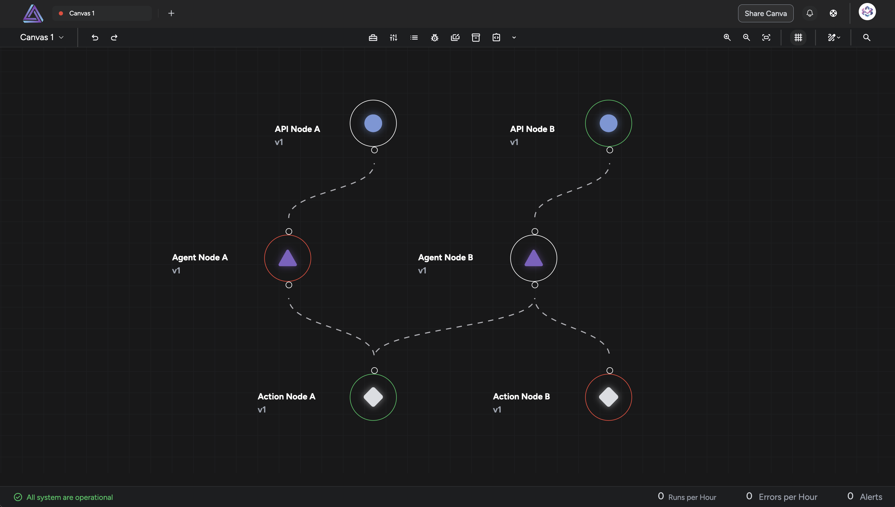

# Triform

This repository is the frontend part of the app, developed using SvelteKit. Everything is canvas-based, which is a dynamic and modular workspace designed for building, visualizing, and managing AI functionality. The platform prioritizes flexibility and scalability, providing an intuitive interface that supports the development of AI implementations at scale.



## Setup Instructions

1. Run `npm install` to install the dependencies.
2. Create an .env file using the contents of example.env as a template.
3. Generate the authentication secret locally by running `openssl rand -hex 32`. Assign the generated secret appropriately in the .env file.
4. Add the GitHub OAuth client ID and secret to your .env file by creating OAuth credentials in your [Github Developer Settings](https://github.com/settings/developers).
5. Clone the backend repository [triform-api](https://github.com/TriformAI/triform-api) and set up the backend server according to the instructions provided in the README.md file.
6. Ensure the backend is running in a separate terminal tab at the URL defined in the .env file.

## Developing

Once you've created a project and installed dependencies with `npm install` (or `pnpm install` or `yarn`), start a development server:

```bash
npm run dev
# or start the server and open the app in a new browser tab
npm run dev -- --open
```

## Building

To create a production version of your app:

```bash
npm run build
```

You can preview the production build with `npm run preview`.

To deploy your app, you may need to install an [adapter](https://kit.svelte.dev/docs/adapters) for your target environment.

### Updating agent worker schema
Assuming that you have cloned the [agent-worker repo](https://github.com/TriformAI/agent-worker/tree/master)
and placed it in the same folder as triform-app repo, then you can simply run

`npm run parse:schema`

this will generate the ts types and put them in this file `src/lib/types/schema.ts`
